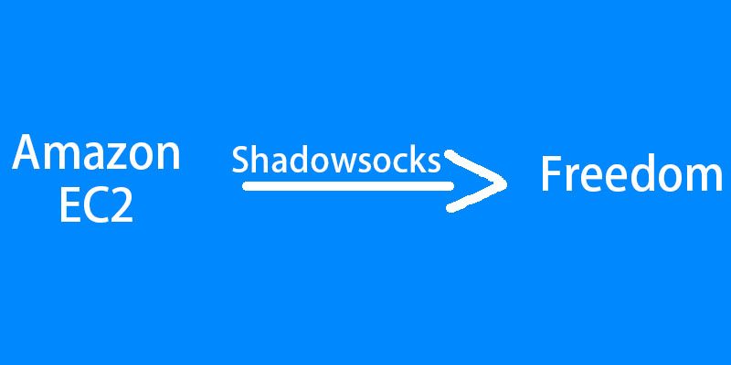
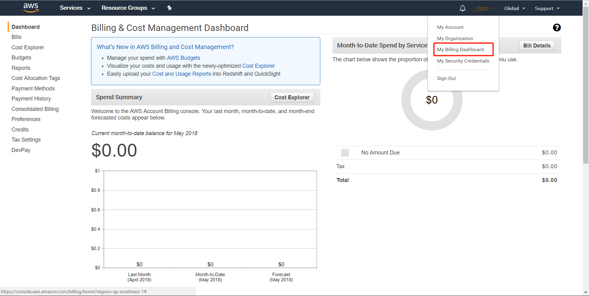
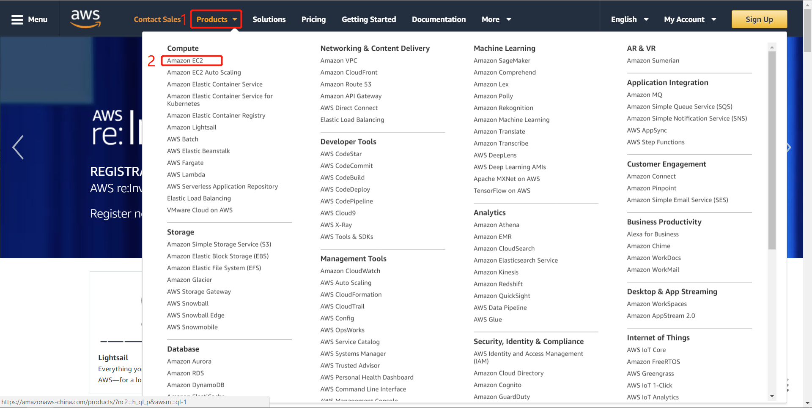
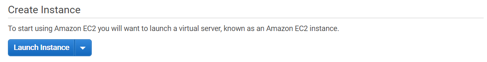
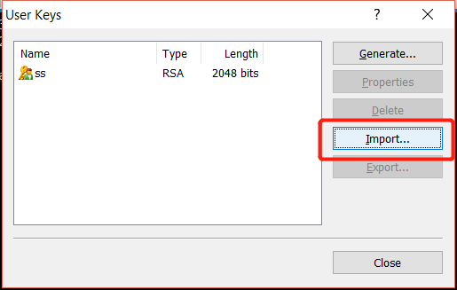
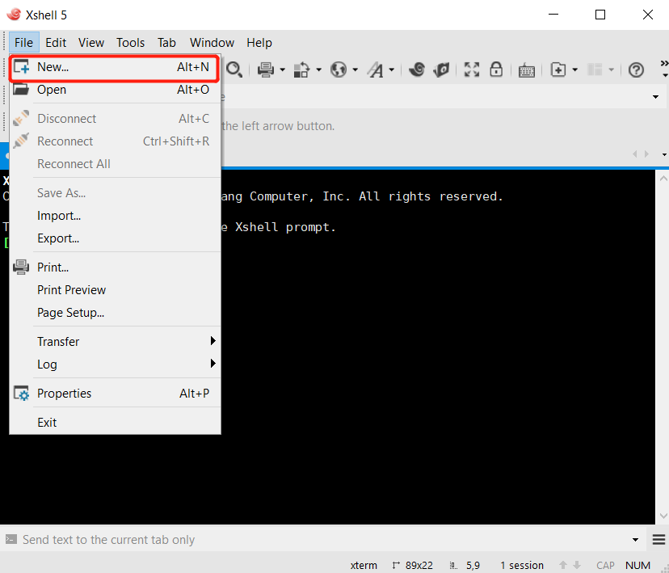

<!-- https://raw.githubusercontent.com/zhulinn/zhulinn.github.io/hexo/source/uploads/post_pics/XXX.png -->



# 前言
<hr>
暑期回国，给自用的Sumsung S8恢复了出厂。万万没想到的是，由于手机是美版的，需要谷歌账号验证激活，否则无法进入系统。

卒。

最后好不容易给电脑用上VPNGate，共享Wifi给手机翻墙，成功激活手机。途中尝试了一些曾经用过的免费VPN软件，如赛风、XX-Net，效果都不尽人意。之前有用过Amazon AWS，里面涵盖一年免费的服务器套餐，于是准备利用其中的Amazon EC2,自己搭建个VPN服务器配合shadowsocks,搭个自用的梯子。

<!-- more -->

# Amazon AWS EC2
Amazon对新用户提供一些一年免费的服务。我们需要用的就是AWS EC2
(虚拟服务器)。需要注意的是：
* EC2每个月有750个小时的免费使用时间。这个时长是所有实例运行时间的总长，如果你只有一个实例，完全可以满足24小时的全天候运行。
* 每个月上传/下载各15GB免费流量。VPN服务器主要使用的是下载流量。15GB足够满足个人使用。
* 还有一些免费额度，一般不会超额。建议大家开启超额预警，同时在账单页面关注自己的使用情况。




# 流程
这里我们使用Amazon EC2作为海外服务器，通过安装shadowsocks服务器版，架设VPN服务器。在手机、电脑上安装shadowsocks客户端，科学上网。

## Amazon注册
Amazon注册流程在这里就不啰嗦了，网上的教程也很多。注册过程需要绑定一张信用卡，如果你的使用量都涵盖在免费套餐内，是不会随意扣费的，这点放心。不过当用户使用量超额时，会自动扣费，所以需要时刻关注自己的套餐使用量.

## EC2服务器创建
### 1. 登陆Amazon AWS，Products标签页下选择Amazon EC2。




### 2. EC2页面上，创建新的实例。



注意要看页面右上角，显示着服务器实例的所在区域。如图，


我的是Singapore，即我的VPN服务器架设在Singapore节点。服务器将会转发你的上网数据，理论上节点离你越近，你的网速越快。这里可以用[CloudPing.info](http://www.cloudping.info/)对Amazon提供的各个节点进行测速，选择理想的节点。

#### **特别注意**对于新用户, Amazon只提供**Ohio，Oregon，Virginia**三个节点。因此若使用其他节点，会出现创建失败的情况。


<p align="right">From [StackOverflow](https://stackoverflow.com/questions/46649542/aws-ec2-cant-launch-an-instance-account-blocked)</p>
解决方案如邮件所说，向 aws-verification@amazon.com 发邮件申请既可。

### 3. 选择Ubuntu Server，实例类型我们选择支持免费套餐的micro类型。


### 4. 保持默认配置不变，我们直接跳到第6步，配置安全组。为了方便，我们可以直接添加如下规则。


### 5. 配置完成后，创建新实例。这时会让你选择服务器的密钥对，我们选择创建新的密钥对。名字随意。创建后，下载并**保持**钥匙对，用来连接服务器。**务必保存好**。


### 6. 创建完成后，服务器已经开始运行。我们可以进入EC2面板，查看正在运行的实例。我们需要服务器的公网IP地址，用来连接服务器。


<hr>
至此，Amazon EC2服务器算是创建好了，下一步我们将在服务器上安装shadowsocks服务器版。参考网上的教程总结如下。

## shadowsocks服务器版安装
### 1. 连接服务器实例
因为用的是Windows，我就说下Windows如何连接Amazon EC2服务器。OS X请参考相关教程。
Windows下，需要用到[Xshell5](http://sw.bos.baidu.com/sw-search-sp/software/a69a658e568d8/Xshell_5.0.1333.exe)软件进行连接。
安装完成后，我们首先添加密钥对。就是刚刚创建实例时，我们下载的密钥对。
进入**用户密钥管理员**，导入我们之前下载的.pem文件。




之后创建与服务器的会话。



填写服务器的公网IP地址。


之后配置认证信息。选择**Public Key**方法，用户名填写为**ubuntu**（否则报错）。用户密钥栏选择我们刚刚导入的密钥对即可。


最后点击确定后，在会话窗口选择创建的会话进行连接。首次连接，会提示警告，选择接受并保存即可。成功连接后如图。


### 2. 安装shadowsocks

``` bash
# 获取root权限
sudo -s
# 更新apt-get
apt-get update
# 安装python包管理工具
apt-get install python-setuptools
apt-get install python-pip
# 安装shadowsocks
pip install shadowsocks
```

安装pip后，可能会提示更新pip，不需要更新，否则之后安装Shadowsocks会报错。

### 3. 配置shadowsocks
安装完成后，创建配置文件。
``` bash
vim /etc/shadowsocks/ss.json  
```

按i进入输入模式，复制以下内容。
``` bash
{
    "server":"0.0.0.0",
    "server_port":443, //ss连接服务器的端口
    "local_address":"127.0.0.1",
    "local_port":1080,
    "password":"abcd1234", // 设置ss连接时的密码
    "timeout":300,
    "method":"aes-256-cfb",
    "fast_open":false,
    "workers": 1
}
```

### 4. 启动shadowsocks
启动：`sudo /usr/local/bin/ssserver -c /etc/shadowsocks/ss.json -d start`
停止：`sudo /usr/local/bin/ssserver -c /etc/shadowsocks/ss.json -d stop`  
重启：`sudo /usr/local/bin/ssserver -c /etc/shadowsocks/ss.json -d restart`

设置自启动。
``` bash
sudo vi /etc/rc.local
```
在rc.local文件末尾添加以下代码：

`sudo /usr/local/bin/ssserver -c /etc/shadowsocks/ss.json -d start`

<hr>
至此Amazon EC2 + Shadowsocks 的VPN服务器已经假设完成。
本地设备通过shadowsocks客户端连接VPN服务器，即可实现翻墙。添加服务器，地址即为Amazon EC2的公网IP，端口为配置文件中设置的443，密码为abcd1234。

shadowsocks客户端可从Github上下载。
[shadowsocks-安卓版](https://github.com/shadowsocks/shadowsocks-android/releases)
[shadowsocks-Windows版](https://github.com/shadowsocks/shadowsocks-windows/releases)